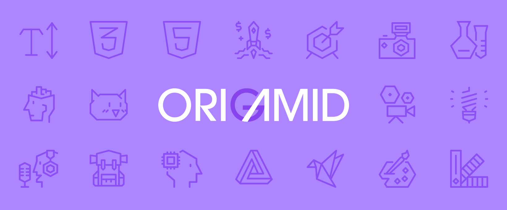

<h1>Flexblog</h1>

 &nbsp;
 

>Projeto de *Landing Page* desenvolvido com base no curso CSS Flexbox da [Origamid](https://www.origamid.com/)

## 💻 Sobre o Projeto

O intuito deste projeto é de aplicar na prática os conceitos teóricos de CSS Flexbox, através de um projeto real que simula as principais adversidades que um programador Front-End enfrenta no dia a dia, consolidando as bases!

## 🚀 Tecnologias e Ferramentas

*Este projeto foi desenvolvido com:*

- HTML5
- CSS3
- VSCode
- Git & GitHub Pages

## 📚 Aprendizado

*Neste projeto eu pratiquei:*

- CSS Flexbox
- Flex-content vs Flex-item
- Posicionamento e relacionamento entre tags pai/filho
- Redução de media queries através do CSS Flexbox

## ⚙️ Materiais Utilizados

- Google Fonts: [Nunito](https://fonts.google.com/specimen/Nunito)

## 💻 Tela

*Você pode conferir o projeto [clicando aqui!](https://dannesx.github.io/flexblog/)*

## 🤖 Créditos & Agradecimentos

*Sem eles, este projeto não seria possível!*

- [André Rafael - Origamid](https://www.origamid.com/)

## 📋 Licença

Este projeto está sob a licença [MIT](LICENSE). Projeto realizado apenas para fins didáticos. Fique à vontade para utilizar todo o conteúdo deste repositório!

---

Obrigado pela atenção! 😃